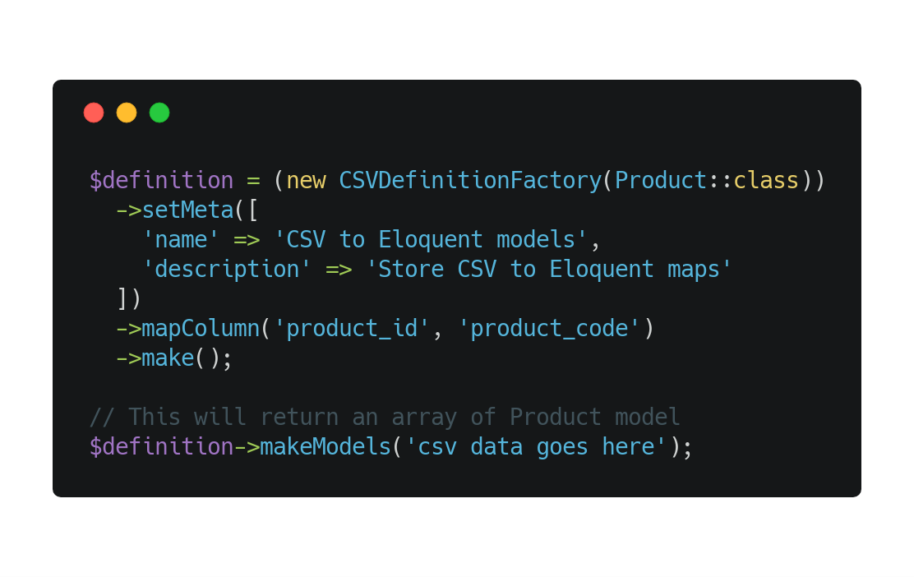

# 💾 Eloquent CSV Importer
[](https://travis-ci.org/langleyfoxall/eloquent-csv-importer)

Eloquent CSV Importer helps create and store column maps to enable the easy conversion of CSV data to Eloquent models

<p align="center">
    
</p>

## Installation

Eloquent CSV Importer can be easily installed using Composer. Just run the following command from the root of your project.

```
composer require langleyfoxall/eloquent-csv-importer
```

The service provider is to set to be auto discovered in Laravel 5.5+ - in older versions you will have to manually register it in `config/app.php`

```
LangleyFoxall\EloquentCSVImporter\EloquentCSVImporterServiceProvider::class
```

After this, publish the vendor files to copy the CSV definitions migrations to your migrations folder.

```
php artisan vendor:publish
```

## Documentation

#### Getting started

1. Publish the migrations, add any additional columns to the csv_defintions table you may want & migrate.

```
php artisan migrate
```

2. Add the `CSVMappable` & `HasCSVDefinitions` traits to the model you want to store CSV definitions agaisnt.

```php
...

use LangleyFoxall\EloquentCSVImporter\Traits\CSVMappable;

class Product extends Model
{
    use CSVMappable, HasCSVDefinitions;
    
    ...
    
}
```

3. Specify the columns that you want to be allowed to be mapped by overriding the `getCSVMappableColumns()` function, by default it uses all the columns of the model.

```php
public static function getCSVMappableColumns()
{
    return collect([
        'product_name',
    ]);
}
```

3. Create a CSV definition for your model you want to map to

```php
$definition = (new CSVDefinitionFactory(Product::class))
    ->mapColumns(['product ID' => 'product_name'])
    ->setMeta([
        'name' => '2009 - 2010 products',
        'description' => 'Definitions for the 2009 - 2010 product lists',
    ])->create();
```

4. You can now use the created definition to convert CSV files / strings into the related models.

```php
$def = Product::first()->CSVDefinitions()->first;
$products = $def->makeModels($csvFile, []);
```

#### Updating by columns

Eloquent CSV Importer allows not only the creation of models from a CSV but the updating of models based on specified keys in the CSV.

Lets say you have the follow CSV:

| product ID    | price         |
| ------------- | ------------- |
| product-001   | 12.99         |
| product-002   | 13.99         |

And the following code to map your CSV file into your models

```php
$products = $def->makeModels($csvFile, ['product ID']);
```

The above code will now update or create a product model by finding a product where `product_name` is equal to the value in the current CSV row or by creating a new one with the data in the current CSV row if one doesn't already exist.

You can pass in multiple keys to update like so:

```php
$products = $def->makeModels($csvFile, ['product ID', 'price']);
```

This will update an existing product where both values in the product are equal to the specified values in the CSV row.

#### Data item manipulation

If you wish, you can manipulate the data as it is being imported from the CSV. To do this, you must create a new a
data item manipulator function, and then set it against the CSV definition.

The data item manipulator function will receive the data item key, value, and a copy of the entire row
from the CSV. After making changes, it should return the modified data item value.

The example below converts any value it receives to uppercase.

```php
$definition->setDataItemManipulator(function($key, $value, $row) {
    return strtoupper($value);
});
```

The data item manipulator should be set before you call the `makeModels` or `createModels` methods.